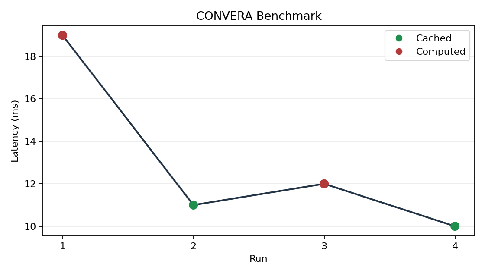

# CONVERA
Inference should not start from zero every time.

CONVERA is an experimental local inference runtime that treats repeated work as
reusable state. The public build is CONVERA-OSS: a functional lite runtime with
model loading, prompt-level KV persistence, local token graph reuse, benchmarks,
telemetry, and a fixed-size content-addressed tensor store.

## What It Does

Traditional inference reruns similar work again and again. CONVERA-OSS keeps a
local reusable-state layer so repeat prompts and related runs can reuse stored
runtime artifacts.

The repo includes:

- Hugging Face model loading
- backend selection for CUDA, ROCm-compatible PyTorch, MPS, and CPU
- prompt-level KV cache persistence
- local token graph lookup
- `convera_store_lite`, a fixed-size deduplicated tensor store
- benchmark/report tooling
- local dashboard
- privacy-first telemetry client

## Lite Runtime

This repository includes the lite runtime.

Higher-efficiency runtime acceleration layers are not included in CONVERA-OSS.
Public extension points stay inside the sealed `convera_core_api.interface`
contract.

Public API boundary:

```python
from convera_core_api import interface

refs = interface.store_tensor(tensor)
tensor = interface.load_tensor(refs)
kv = interface.optimize_kv(kv)
state = interface.merge_states(state_a, state_b)
```

That API returns only tensors, references, and minimal metadata.

## Quick Start

```bash
/opt/homebrew/bin/python3.12 -m venv .venv312
source .venv312/bin/activate
pip install -e .
convera health
```

Download a model into `models/llama3` before running inference. Meta Llama
models may require Hugging Face authentication and license acceptance.

```bash
hf auth login
python scripts/download_llama.py
```

The default target is `meta-llama/Meta-Llama-3-8B`. If Hugging Face reports that
the repository requires approval, accept the model license with the same account
and rerun the command.

## Run

```bash
convera run --prompt "Explain neural networks in detail."
convera benchmark
uvicorn ui.app:app --reload
```

Dashboard:

```text
http://127.0.0.1:8000/static/index.html
```

## Benchmark

```bash
python -m benchmarks.benchmark
```

The benchmark reports:

- latency
- tokens/sec
- KV hit rate
- chunk reuse ratio
- disk usage

For a small public repeated-prompt check:

```bash
python -m metrics.benchmark_runner
```

Output:

```text
metrics/output/benchmark.json
metrics/output/benchmark.png
metrics/output/comparison.png
```

Example output:

```text
Run 1:
  Cached: False
  Latency: 120 ms

Run 2:
  Cached: True
  Latency: 40 ms
```

The public benchmark reports only cache hit status, latency, and response
length. It does not expose token traces, cache contents, or runtime internals.

The benchmark JSON also includes high-level compute accounting:

- tokens computed
- tokens reused
- compute avoided percentage
- selected precision
- validation status

## Benchmark Visualization

Run:

```bash
python -m metrics.benchmark_runner
```

Then open the UI or view the generated graph:

```text
http://127.0.0.1:8000/benchmark-graph
```



## Runtime Precision

The public runtime can request `fp16`, `int8`, `int4`, or `auto` precision.
Quantized modes use supported Hugging Face loading paths when available and
fall back safely on unsupported local hardware.

CLI example:

```bash
convera run --precision auto --prompt "Explain neural networks in detail."
```

UI users can select precision from the dashboard dropdown.

## Deterministic Routing And Validation

CONVERA-OSS includes a public deterministic execution router and lightweight
validation records. These public components expose only high-level behavior:

- `cache`
- `kv`
- `full`
- validation true/false

They do not expose private decision logic, token traces, scoring formulas, or
runtime internals.

## Adaptive Routing And Audit Traces

CONVERA-OSS records public runtime outcomes and uses them to tune simple
execution thresholds over time. The public routing model is conservative: it
only proposes public execution modes when enough local history exists, and it
falls back to deterministic routing otherwise.

The local dashboard also includes an execution inspector and optional audit
trace export. Audit traces contain prompt hashes, route mode, precision,
latency, token counts, and validation status. They do not contain prompts,
outputs, raw tokens, local paths, or private runtime internals.

Enable audit mode for all runs:

```bash
CONVERA_AUDIT_MODE=1 uvicorn ui.app:app --reload
```

Or enable it per request in the UI with the `Audit trace` checkbox.

Audit endpoints:

```text
GET /api/execution/latest
GET /api/execution/{request_id}
GET /audit/{request_id}
GET /audit/{request_id}/export?format=json
GET /audit/{request_id}/export?format=csv
```

Enable validation mode locally with:

```bash
CONVERA_VERIFICATION_MODE=1 uvicorn ui.app:app --reload
```

Status endpoint:

```text
http://127.0.0.1:8000/status
```

## Privacy

Telemetry sends metrics only after `CONVERA_METRICS_API_URL` and
`CONVERA_METRICS_API_KEY` are configured. It does not send prompts, outputs, file
names, or local paths.

The server-side telemetry contract is documented in
[`SERVER_HAND_OFF.md`](SERVER_HAND_OFF.md).

## Direction

CONVERA-OSS is the adoption layer. It is intentionally useful, inspectable, and
easy to run.
